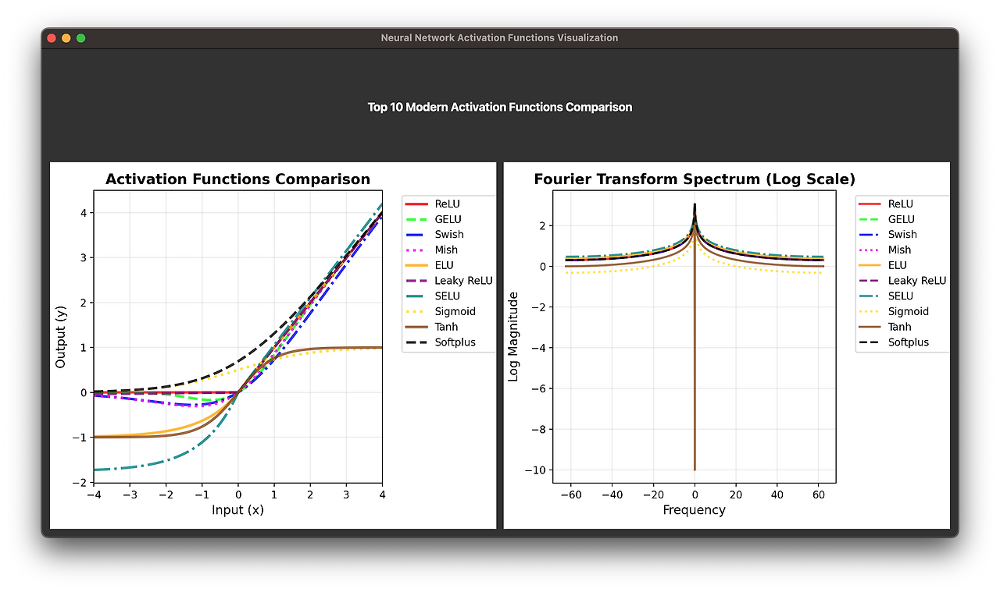

# Activation Functions Spectrum Comparison

A comprehensive visualization tool for comparing modern neural network activation functions and their Fourier Transform spectrum analysis.



## Overview

This project provides an interactive PyQt5-based application that visualizes the top 10 most commonly used activation functions in deep learning along with their frequency domain characteristics through FFT (Fast Fourier Transform) analysis.

## Features

- **Real-time Visualization**: Side-by-side comparison of activation functions and their FFT spectra
- **Modern Activation Functions**: Includes the latest functions like GELU, Swish, and Mish
- **Frequency Analysis**: FFT spectrum analysis to understand the frequency characteristics of each function
- **Interactive GUI**: Built with PyQt5 for smooth user experience
- **Color-coded Display**: Each function has distinct colors and line styles for easy identification

## Screenshot

The application displays two main visualizations:
- **Left Panel**: Activation functions comparison showing the characteristic curves of each function
- **Right Panel**: FFT spectrum analysis revealing the frequency domain properties of each activation function

## Supported Activation Functions

1. **ReLU** (Rectified Linear Unit)
2. **GELU** (Gaussian Error Linear Unit)
3. **Swish** (Self-Gated Activation Function)
4. **Mish** (Self Regularized Non-Monotonic Function)
5. **ELU** (Exponential Linear Unit)
6. **Leaky ReLU** (Leaky Rectified Linear Unit)
7. **SELU** (Scaled Exponential Linear Unit)
8. **Sigmoid** (Logistic Function)
9. **Tanh** (Hyperbolic Tangent)
10. **Softplus** (Smooth Approximation to ReLU)

## Requirements

```
python>=3.7
numpy
matplotlib
PyQt5
```

## Installation

1. Clone this repository:
```bash
git clone https://github.com/bemoregt/SpectrumCompareOfActivationFumctions.git
cd SpectrumCompareOfActivationFumctions
```

2. Install required dependencies:
```bash
pip install -r requirements.txt
```
or
```bash
pip install numpy matplotlib PyQt5
```

## Usage

Run the main application:

```bash
python activation_visualizer.py
```

Alternative execution:
```bash
python run.py
```

The application will open a window with two main panels:
- **Left Panel**: Displays the activation functions plotted over the range [-4, 4]
- **Right Panel**: Shows the FFT spectrum (log scale) of each activation function

## Technical Details

### Activation Function Implementations

Each activation function is implemented with numerical stability considerations:

- **Clipping**: Applied to prevent overflow in exponential functions
- **NaN Handling**: Automatic conversion of NaN and infinite values
- **Optimized Parameters**: Using standard parameters for each function

### FFT Analysis

- **Sampling**: 1000 points over [-4, 4] range
- **Windowing**: Applied FFT with proper frequency shifting
- **Log Scale**: Magnitude spectrum displayed in logarithmic scale
- **Frequency Range**: Normalized frequency domain visualization

## Applications

This tool is useful for:

- **Deep Learning Research**: Understanding activation function characteristics
- **Educational Purpose**: Teaching signal processing concepts in neural networks
- **Function Selection**: Comparing functions for specific neural network architectures
- **Frequency Analysis**: Understanding how different activations affect signal frequencies

## File Structure

```
SpectrumCompareOfActivationFumctions/
├── activation_visualizer.py    # Main application file
├── run.py                      # Simple execution script
├── requirements.txt            # Python dependencies
├── README.md                   # Project documentation
├── LICENSE                     # MIT License
├── .gitignore                  # Git ignore rules
├── DOCS.md                     # Detailed documentation
└── actispect.png              # Application screenshot
```

## Contributing

Contributions are welcome! Please feel free to submit a Pull Request.

## License

This project is open source and available under the [MIT License](LICENSE).

## Author

Developed by bemoregt

## Acknowledgments

- Inspired by recent advances in activation function research
- Built using matplotlib and PyQt5 for robust visualization
- FFT analysis implementation using NumPy's efficient algorithms
